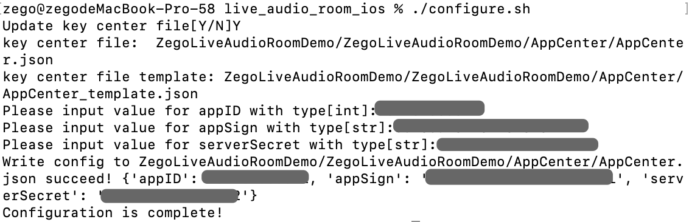
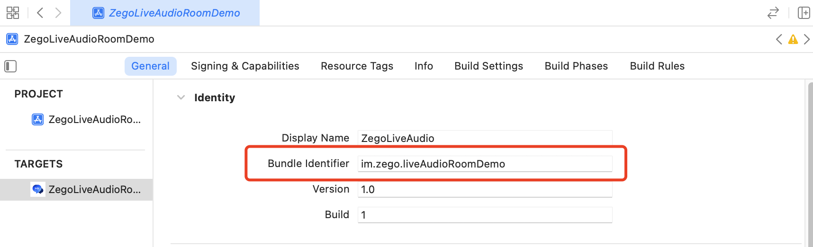
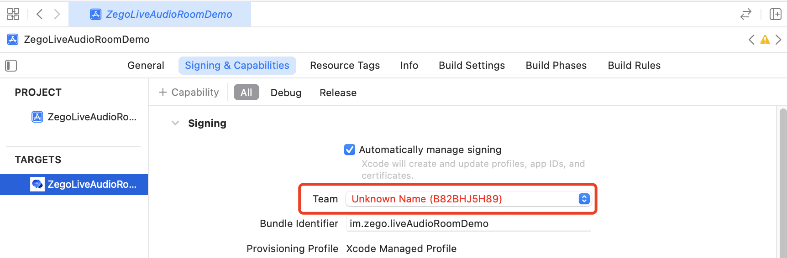
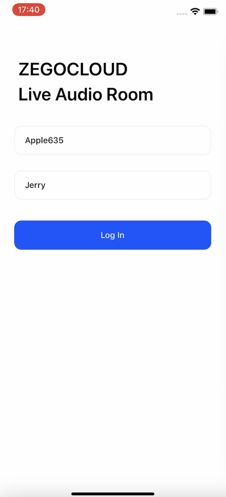

# ZEGOCLOUD Live Audio Room

ZEGOCLOUD's Live Audio Room solution is a one-stop solution for building full-featured live audio rooms into your apps, including interactive live audio streaming, instant messaging, room management, and in-room controls.

In live audio rooms, users can host, listen in, and join live audio conversations. Users can also interact with each other via text chat, virtual gifting, "bullet screen" messages, and other features. In a single room, there can be up to 50 speakers at the same time and an unlimited number of listeners.

With ZEGOCLOUD's Live Audio Room, you can build different types of live audio apps, such as online werewolf (a voice-based social deduction game), online karaoke, and more.

## Getting started 

Before getting started with the Live Audio Room application, **contact us to activate the Live Audio Room (RTC + IM) service first**, and then do the following:

### Prerequisites

* [Xcode 7.0 or later\|_blank](https://developer.apple.com/xcode/download)
* [CocoaPods\|_blank](https://guides.cocoapods.org/using/getting-started.html#installation)
* An iOS device or Simulator that is running on iOS 9.0 or later and supports audio and video. We recommend you use a real device.
* Create a project in [ZEGO Admin Console\|_blank](https://console.zego.im/). For details, see [ZEGO Admin Console - Project management\|_blank](https://docs.zegocloud.com/article/1271).

### Install Pods

1. Clone the Live Audio Room Github repository. 
2. Open Terminal, navigate to the `ZegoLiveAudioRoomDemo` folder where the `Podfile` is located, and run the `pod repo update` command.
3. Run the `pod install` command to install all dependencies that are needed.

### Modify the project configurations
1. For MacOs, open Terminal, navigate to the `live_audio_room_ios` folder where the `configure.sh` is located. 
2. Run the configuration script with the `./configure.sh` command. And fill in the AppID, AppSign, and ServerSecret, which can be obtained in the [ZEGO Admin Console\|_blank](https://console.zego.im/).  
**Note**: If you are using Windows system, double-click the `configure.bat` to run the configuration script. 

3. Open the `ZegoLiveAudioRoomDemo.xcworkspace` in Xcode.
4. In the **General** tab of the `ZegoLiveAudioRoomDemo` project, change the `Bundle Identifier` configuration.   

5. Click the **Signing & Capabilities** tab and select your own developer certificate in the **Team**.  

### Run the sample code

1. Connect the iOS device to your computer.
2. Open Xcode, click the **Any iOS Device** in the upper left corner, select the iOS device you are using.
3. Click the **Build** button in the upper left corner to run the sample code and experience the Live Audio Room service.

## More documentation
You can find more documentation on our official website: [Live Audio Room (RTC+ IM)](https://doc-en.zego.im/article/13793).
